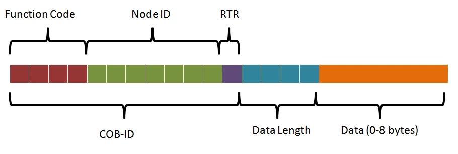

# CAN

[Text Intro](https://www.can-cia.org/can-knowledge/)

[Visual Intro](https://www.youtube.com/watch?v=DlbkWryzJqg)

Is a serial communication protocol that's gained popularity due to it's robustnest against interference and data lost. Broadly used in the industry. Or at least, that's what CAN Bus is, but CAN can be easily undertood from a [ISO model](https://www.can-cia.org/index.php?id=systemdesign-can-physicallayer). 

## CAN Frame: 
Message send on a CAN Network, the differences between generations are ID length, data bytes, just to name a few. 

It can have different purposes, and such different service indicators. Every service has allocated different word aranges, and purposes, so, be careful when choosing. 
* NMT: Network Management. Control the node state.
* SYNC: Syncronization. Syncrorinez inputs and outputs between the network and the master. 
* EMCY: Emergency. Communicate to all the network a node is failing, along with failure info.
* PDO: Process Data Object. Transmit real-time data, along with timestamps
* SDO: Service Data Object. Transmit non real-time data
    * SDO recieve (request)
    * SDO transmit (response)
    * Monitoring: periodically check if all the nodes are fine.

**COB-ID:** Communication Object Identifier, a combatin of the Node ID and the function mode. 

### CAN Functions
Function code:
Stabilished the intent of the CAN frame. Each funcition code has several CAN Nodes IDs

### CAN ODS
Object Dictionaries.

A unique attribute for a CAN node (device). It contains entries with device configuration as a standarized structure. I can be accesed by SDO.

Components:
* Index (node ID)
* Object node
* Object code
* Datatype
* Access
* Category

### CAN EDS
Electronic Data Sheet.
Standaratized file format for ODS. Like a human readable ODS. Template for the OD file. Contains device objects. And service tools to update devices.

Note: The network tool will not connect to a device unless all four identity object parameters match.

[Source](https://www.rtautomation.com/rtas-blog/ethernet-ip-eds-update/#:~:text=Electronic%20Data%20Sheets%20(EDS)%20are,tool%20to%20recognize%20the%20device.)

### CAN DCF:
Device Configuration File.
Like a more complete EDS, with more than generic parameters

### From:
[What are PAL, HAL, CAL?](https://www.linkedin.com/pulse/importance-well-designed-architecture-embedded-software-prajwal-b-v)

[CAN Bus](https://www.csselectronics.com/pages/can-bus-simple-intro-tutorial)

[CAN Open](https://www.csselectronics.com/pages/canopen-tutorial-simple-intro)

[CANOpen Frame](https://www.ni.com/es-mx/innovations/white-papers/13/the-basics-of-canopen.html)

------

### Go deeper!:
[CAN FD](https://www.csselectronics.com/pages/can-fd-flexible-data-rate-intro)

[CAFOpen & CANFD interoperability](https://www.can-cia.org/fileadmin/resources/documents/proceedings/2013_merkel.pdf)

J1939
IoT CAN Loggers
